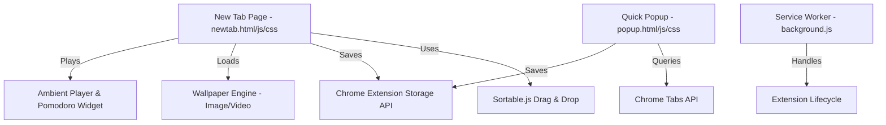

# 🧭 AmitMarks GSD Codebase Roadmap

Welcome to the **AmitMarks** GSD Roadmap & Architecture Specification. This document outlines the codebase, architecture patterns, dependencies, and planned milestones for AmitMarks (a highly-visual bookmark manager extension inspired by LumiList).

---

## 🛠️ Codebase Architecture & Components

### 📂 File Inventory & Responsibilities
- 📄 **[manifest.json](file:///d:/CODES/antigravity_projects/Amit%20Marks/manifest.json)**: Extension manifest (MV3), overrides chrome default new tab, permissions (`storage`, `tabs`, `activeTab`).
- 📄 **[newtab.html](file:///d:/CODES/antigravity_projects/Amit%20Marks/newtab.html)** / **[newtab.js](file:///d:/CODES/antigravity_projects/Amit%20Marks/newtab.js)** / **[newtab.css](file:///d:/CODES/antigravity_projects/Amit%20Marks/newtab.css)**: The main dashboard interface featuring multi-page tabs, boards, widgets, ambient player, timer, and high-fidelity video/image wallpaper management.
- 📄 **[popup.html](file:///d:/CODES/antigravity_projects/Amit%20Marks/popup.html)** / **[popup.js](file:///d:/CODES/antigravity_projects/Amit%20Marks/popup.js)** / **[popup.css](file:///d:/CODES/antigravity_projects/Amit%20Marks/popup.css)**: Small panel popup triggered from Chrome extension bar to quickly save the current page to a specific Page/Board.
- 📄 **[background.js](file:///d:/CODES/antigravity_projects/Amit%20Marks/background.js)**: Service worker handling the background script lifecycle.
- 📄 **[sortable.min.js](file:///d:/CODES/antigravity_projects/Amit%20Marks/sortable.min.js)**: Third-party library for smooth drag-and-drop board/item sorting.

---

## ⚡ Active Features
1. **Dynamic Workspace Layout**: Supports multiple Pages, with individual Boards containing interactive Bookmark list items.
2. **Visual Customization**: Supports static background images and live MP4/WebM video backgrounds (from URL or local files).
3. **🔋 Battery Saver Mode**: Intelligently toggles video playback state (Auto/Always ON/Always OFF) based on active tab focus, battery level, or system usage to conserve resources.
4. **🎵 Focus Widgets**: Ambient audio player (heavy rain, waves, noise) paired with a customizable focus Pomodoro timer.
5. **Drag-and-Drop Sorting**: Boards and bookmarks can be sorted fluidly using Sortable.js.

---

## 🎯 GSD Roadmap & Milestones

### **Phase 1: Code Optimization & Resilience** ⏳
- Optimize Storage API calls with proper caching layer to avoid duplicate reads.
- Refactor DOM injection in `newtab.js` to prevent memory leaks with complex lists.

### **Phase 2: Advanced Widget Upgrades** 📅
- Add custom Spotify / YouTube embed music widget option.
- Implement an offline To-Do list widget integrated on the sidebar.

### **Phase 3: Backup & Sync Engine** 🔄
- Support Exporting/Importing bookmarks & settings as a JSON file.
- Add optional sync with standard Google/Chrome cloud bookmarks.
